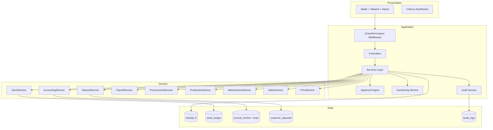
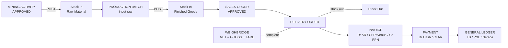
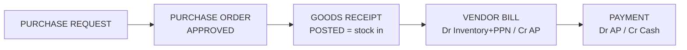
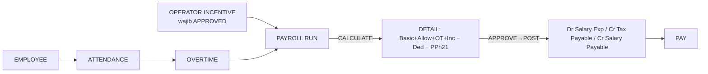

# Arsitektur Sistem

## High-Level Architecture



## Service Layer

Semua business logic kritikal berada di `app/Services` — controller hanya orkestrasi HTTP:

| Service | Tanggung Jawab |
|---|---|
| `AccountingService` | Post jurnal double-entry (validasi D=C), reversal, fiscal period guard, mapping COA |
| `StockService` | Stock movement ledger (append-only), validasi stok minus, moving average cost, reservasi |
| `DepositService` | Ledger deposit (IN/USED/REFUND), validasi overdraft, jurnal otomatis |
| `SalesService` | Complete DO (stok keluar + SO update), buat faktur + jurnal, terima pembayaran FIFO |
| `ProcurementService` | Post GRN (stok masuk), post vendor bill (Dr Inventory/Expense, Cr AP), bayar supplier |
| `ProductionService` | Post batch: konsumsi raw, output FG, scrap, jurnal konversi biaya |
| `MaintenanceService` | Issue sparepart: stok keluar + maintenance cost + jurnal |
| `PayrollService` | Kalkulasi gaji (basic+tunjangan+OT+insentif−potongan−PPh21), posting jurnal, pembayaran |
| `PriceService` | Resolusi harga berjenjang, pencatatan price variance |
| `ApprovalService` | Central approval engine (workflow, step, delegasi, notifikasi) |
| `NumberingService` | Nomor dokumen concurrency-safe dengan period reset |
| `AuditService` | Audit trail semua aksi transaksional |

## Pola Inti

### 1. Stock Movement Ledger (append-only)
```php
StockService::move($warehouseId, $itemId, $movementType, $qtyIn, $qtyOut, ...);
// Validasi: stok tidak boleh minus (dapat dikonfigurasi via settings)
// Moving average cost dihitung otomatis saat qty_in > 0
```

### 2. Accounting Posting (immutable + reversal)
```php
AccountingService::post($companyId, $date, $lines, $sourceType, $sourceId, ...);
// Throw DomainException jika SUM(debit) != SUM(credit)
// Throw jika periode fiskal sudah CLOSED
AccountingService::reverse($entry, $reason); // membuat jurnal cermin POSTED
```

### 3. Central Approval Engine
```php
ApprovalService::submit($module, $transactionType, $transaction);
// Mencari ApprovalWorkflow aktif → build ApprovalRequest + ApprovalAction per step
// Tanpa workflow terdaftar → auto-approve (perilaku dapat diubah)
ApprovalService::actOnActionId($actionId, $user, 'APPROVE'|'REJECT'|'RETURN', $notes);
```

### 4. Concurrency Safety
- `DB::transaction` pada semua posting
- `lockForUpdate()` pada numbering & stock
- Unique constraint pada nomor dokumen

### 5. Resilience & Side-Effect Parity
- `Setting::get()` mengembalikan default bila tabel `settings` belum ada
  (installer, error pages) — branding tidak pernah meledakkan render.
- `ApprovalResolver` memiliki handler side-effect per tipe (`PURCHASE_REQUEST`
  → komitmen budget, survei, kontrak, HSE) sehingga approval via Center dan
  via tombol direct menghasilkan efek yang identik; `commit()` idempoten via
  `updateOrCreate`, dan fase `act()` terbungkus transaksi (gagal = rollback).
- `BudgetService::commit*` mengembalikan `null` (no-control) bila mapping/COA
  belum dikonfigurasi — approval tidak boleh mati di fresh install.

## Programmatic SEO Engine

`SeoPageGenerator` (cap 22.000, tier 1–5) → `SeoContentService`
(deterministik) → `SeoQualityService` (gate PASS/WARNING/FAIL) →
`SeoInternalLinkService` (related ≤12 + hub pillar, orphan 0) →
`SeoSitemapService` (index + children, cache, hanya indexable).
WhatsApp conversion terpusat di `WhatsappService` (Rp12.000.000 konstan,
nomor ternormalisasi 6281296052010). Rute publik di `routes/seo.php`
(di-require paling akhir; catch-all mengembalikan 404/410 asli untuk
non-SEO). Admin di `MarketingSeoController` (permission `marketing.*`).
Detail: `docs/PSEO_ARCHITECTURE.md`.

## Alur Bisnis End-to-End






