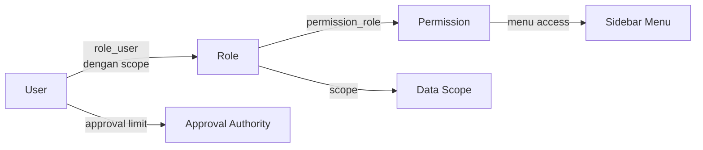

# RBAC — Role, Permission & Data Scope

## Hierarki Otorisasi



## Permission Format

`{module}.{action}` — 47 modul × 14 aksi = **658 permission**:

Aksi: `view, create, update, delete, approve, reject, cancel, post, unpost, print, export, import, void, reopen`

Contoh: `invoice.post`, `journal.unpost`, `payroll.approve`, `stock.post`, `weighbridge.void`

## 25 Role Sistem

SUPER_ADMIN, SYSTEM_ADMIN, DIRECTOR, GENERAL_MANAGER, MINE_MANAGER, SITE_MANAGER, PRODUCTION_MANAGER, FINANCE_MANAGER, ACCOUNTING, HR_MANAGER, HR_STAFF, PAYROLL_STAFF, PURCHASING, WAREHOUSE_MANAGER, WAREHOUSE_STAFF, SALES_MANAGER, SALES, WEIGHBRIDGE_OPERATOR, MINE_OPERATOR, MAINTENANCE_MANAGER, MAINTENANCE_TECHNICIAN, DOCUMENT_CONTROL, CSR, AUDITOR, VIEWER

Semua 25 role memiliki permission awal yang sesuai fungsinya (operator/teknisi/staff = tanpa approve/post/delete; manager = dengan approval sesuai modulnya; auditor/viewer = read-only + export/print).

Matriks role→permission tersimpan di `permission_role` dan **editable via UI** (Roles → Matriks Izin).

## Data Scope (role_user.scope + company_id + site_id)

| Scope | Efek |
|---|---|
| `ALL_COMPANIES` | Akses seluruh perusahaan & site |
| `COMPANY` (+company_id) | Terbatas 1 perusahaan, semua site |
| `SITE` (+company_id +site_id) | Terbatas 1 site |
| `OWN_DATA` | Hanya data milik sendiri |

API model User:
```php
$user->hasPermission('invoice.post');      // true juga utk SUPER_ADMIN
$user->isSuperAdmin();
$user->accessibleCompanyIds();              // null = all
$user->accessibleSiteIds();                 // null = all
$user->canSeeSite($siteId);
```

## Enforsemen Backend

1. **Route middleware**: `->middleware('permission:invoice.view')`
2. **Middleware alias** `CheckPermission`:
   - Blokir user non-ACTIVE
   - Redirect paksa ganti password (`force_password_reset`)
   - Mapping nama route → permission (`index/show → view`, `store/create → create`, dst.)
   - Abort 403 bila tidak berizin
3. **Guard di controller**: aksi sensitif mengecek eksplisit, contoh `InvoiceController` via `@can` di view + `hasPermission()` di method approve/post.
4. Menu sidebar otomatis hanya menampilkan item yang izinnya dimiliki user.

## Approval Authority

Approval limit dikonfigurasi per `ApprovalStep` (`min_amount`/`max_amount`) + `role_id`/`user_id` — lihat [WORKFLOW.md](WORKFLOW.md).

## Auditor & Viewer

Khusus read-only: hanya permission `view`, `export`, `print` — tidak bisa create/update/post.
