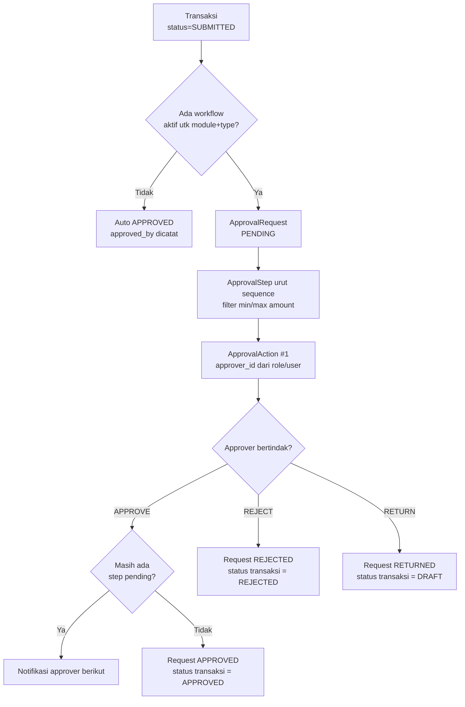

# Workflow & Status Standard

## Status Transaksi Standar

```
DRAFT → SUBMITTED → PENDING_APPROVAL → APPROVED → POSTED → COMPLETED
                    ├── REJECTED (akhir)
                    ├── RETURNED → DRAFT (revisi)
                    └── CANCELLED / VOID
```

Tidak semua modul memakai semua status — sesuai kebutuhan.

## Central Approval Engine



### Konfigurasi Workflow

```php
ApprovalWorkflow: code, name, module, transaction_type, company_id?, site_id?, is_active
ApprovalStep:     workflow_id, sequence, name, role_id|user_id, min_amount, max_amount, mode(SEQUENCE/PARALLEL)
ApprovalRequest:  number, module, transaction_type, transaction_id, amount, status
ApprovalAction:   request_id, sequence, approver_id, action(PENDING/APPROVE/REJECT/RETURN), notes, acted_at
```

Modul terhubung: PR, PO, SO, Payroll Run, Stock Adjustment/Transfer, Work Order, CSR, Price List, Price Variance, Leave, Overtime, Operator Incentive, Document, Mining Activity, Production Batch, Weighbridge Void.

`ApprovalResolver` memetakan `transaction_type` → model dan mengubah status transaksi saat request selesai.

Diuji di `ApprovalEngineTest`: submit → assign approver → unauthorized ditolak → approve/reject menerapkan status → delegasi dapat bertindak.

### Delegasi & Keamanan
- `ApprovalDelegation`: user → delegate, berlaku per periode tanggal
- `actOnActionId()` memvalidasi approver (atau delegate) — approver tak berwenang ditolak
- **Resolusi approver progresif**: site persis → perusahaan yang sama → pemegang peran aktif mana pun — request tidak pernah macet tanpa approver selama peran terisi
- Notifikasi in-app via `ApprovalPending` notification (database channel)

## Workflow per Modul (yang sudah berjalan)

| Modul | Alur |
|---|---|
| Mining Activity | DRAFT → SUBMITTED → APPROVED → POSTED (stok masuk) |
| Production Batch | DRAFT → SUBMITTED → APPROVED → POSTED (stok + jurnal) |
| Weighbridge Void | CANCEL/VOID wajib alasan + approval bila dikonfigurasi |
| PR / PO | DRAFT → SUBMITTED → APPROVED (komitmen budget identik via direct maupun Center; PO → PARTIALLY_RECEIVED → COMPLETED otomatis dari GRN) |
| SO | DRAFT → SUBMITTED → APPROVED → reserve → PARTIALLY_DELIVERED → COMPLETED |
| Payroll | DRAFT → CALCULATED → APPROVED → POSTED (jurnal) → PAID |
| Insentif Operator | DRAFT → APPROVED → INCLUDED_IN_PAYROLL |
| Stock Adjustment / Transfer | DRAFT → APPROVED → POSTED (ledger) |
| Work Order | DRAFT → APPROVED → IN_PROGRESS → COMPLETED → CLOSED (complete terkunci APPROVED/IN_PROGRESS) |
| Surat | DRAFT → NUMBER_RESERVED → REVIEW → APPROVED → SIGNED → SENT → ARCHIVED (atau DRAFT → PUBLISHED → ARCHIVED; REJECTED/CANCELLED/VOID) |
| Kwitansi | DRAFT → ISSUED → CONFIRMED/PAID → VOID (wajib dari payment POSTED) |
| Sparepart | WO → REQUEST → RESERVE → ISSUE (ledger OUT + cost + jurnal) → RETURN (ledger IN ber-referensi) |
| Opname | COUNTING → REVIEW → APPROVED → POSTED (selisih + jurnal variance) |
| Jadwal → WO | next_due dihitung (DAY/MONTH) → `maintenance:generate-wo` / tombol Generate → WO DRAFT (anti-duplikat) |
| Faktur | POSTED saat pembuatan (dari qty terkirim, satu SO satu faktur aktif) → PARTIALLY_PAID → PAID |
| Price List | DRAFT → APPROVED (+ price history) |
| Document | DRAFT → SUBMITTED → APPROVED |
| CSR | PROPOSAL → APPROVED → IN_PROGRESS → COMPLETED |

## Numbering System

`NumberingService::generate($docType, $companyId, $siteId)` — format `{PREFIX}-{YM}--{SEQ}`, reset bulanan/tahunan, aman concurrent (row lock). Prefix per dokumen: MA, PB, WB, TRF, ADJ, PR, PO, GRN, BILL, SO, DO, INV, RCV, PYR, INC, WO, JN, CSR, APR, LV, OT, DEP, PV, BILL, MNT.
